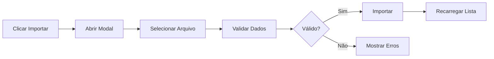

# ✅ Botões de Excel Implementados na Tela de Clientes

## 🎯 Implementação Concluída

Os botões de **Exportar Excel** e **Importar Excel** foram adicionados com sucesso na tela de clientes do sistema.

## 📍 Localização

Os botões estão localizados no **cabeçalho da página de clientes**, ao lado do botão "Novo Cliente":

```
┌─────────────────────────────────────────────────┐
│ Clientes                    [Exportar] [Importar] [+ Novo] │
│ Gerencie as empresas clientes                    │
└─────────────────────────────────────────────────┘
```

## 🔧 Funcionalidades Implementadas

### 1. 📤 **Botão Exportar Excel**
- **Localização:** Cabeçalho da página de clientes
- **Ícone:** Download
- **Comportamento:**
  - Exporta todos os clientes visíveis (respeitando filtro de busca atual)
  - Mostra "Exportando..." durante o processo
  - Faz download automático após exportação
  - Exibe notificação de sucesso/erro

### 2. 📥 **Botão Importar Excel**
- **Localização:** Cabeçalho da página de clientes  
- **Ícone:** Upload
- **Comportamento:**
  - Abre modal de seleção de arquivo
  - Aceita apenas arquivos .xlsx e .xls
  - Valida arquivo antes de importar
  - Mostra progresso da importação
  - Recarrega lista após importação bem-sucedida

## 💡 Como Usar

### 🔹 **Exportar Clientes:**
1. Acesse a página de clientes
2. (Opcional) Use a barra de busca para filtrar clientes específicos
3. Clique no botão **"Exportar Excel"**
4. Aguarde o processamento (botão mostra "Exportando...")
5. O arquivo será baixado automaticamente
6. Verifique a notificação de sucesso

### 🔹 **Importar Clientes:**
1. Acesse a página de clientes
2. Clique no botão **"Importar Excel"**
3. No modal que abrir:
   - Clique em "Escolher arquivo"
   - Selecione um arquivo .xlsx ou .xls
   - Verifique se o arquivo aparece na visualização
4. Clique em **"Importar"**
5. Aguarde o processamento (botão mostra "Importando...")
6. O modal fecha automaticamente após sucesso
7. A lista de clientes é recarregada

## 🎨 Interface Visual

### **Estados dos Botões:**

**Exportar Excel:**
```
Normal:     [📥 Exportar Excel]
Carregando: [⏳ Exportando...]
```

**Importar Excel:**
```
Normal:     [📤 Importar Excel]
Modal:      [📤 Importar] (desabilitado sem arquivo)
Carregando: [⏳ Importando...]
```

### **Modal de Importação:**
```
┌──────────────────────────────────────┐
│ Importar Clientes do Excel           │
│ ──────────────────────────────────── │
│                                      │
│ Arquivo Excel                        │
│ [Escolher arquivo...]                │
│ Apenas arquivos .xlsx e .xls         │
│                                      │
│ 📄 arquivo.xlsx (2.5 MB)             │
│                                      │
│           [Cancelar] [Importar]      │
└──────────────────────────────────────┘
```

## 🔄 Fluxo de Trabalho

### **Exportação Típica:**


### **Importação Típica:**


## ⚙️ Configuração e Filtros

### **Exportação:**
- Respeita o **filtro de busca** atual da página
- Exporta **todos os clientes** que correspondem à busca
- Inclui **todas as 31 colunas** especificadas
- Formato de arquivo: `.xlsx`

### **Importação:**
- **Validação automática** antes de importar
- **Detecção de erros** por linha e campo
- **Rollback** em caso de erro
- **Recarregamento** automático da lista

## 🚨 Tratamento de Erros

### **Exportação:**
- ❌ Erro de rede → Notificação "Erro na exportação"
- ❌ Sem dados → Notificação "Nenhum cliente para exportar"
- ❌ Erro do servidor → Notificação "Erro interno do servidor"

### **Importação:**
- ❌ Arquivo não selecionado → "Selecione um arquivo Excel primeiro"
- ❌ Formato inválido → "Apenas arquivos .xlsx e .xls são aceitos"
- ❌ Dados inválidos → "X registros com problemas. Corrija e tente novamente"
- ❌ Erro do servidor → "Erro ao importar clientes"

## 📊 Notificações do Sistema

### **Tipos de Notificação:**

**✅ Sucesso (Verde):**
- "X clientes exportados com sucesso"
- "X clientes importados com sucesso"

**❌ Erro (Vermelho):**
- "Erro na exportação"
- "Erro na importação"
- "Arquivo com erros"

**ℹ️ Info (Azul):**
- "Exportando..."
- "Importando..."

## 🛠 Aspectos Técnicos

### **Arquivos Modificados:**
- `components/clients-page.tsx` - Componente principal
- Importações das funções de Excel do `lib/api/superadmin.ts`

### **Funcionalidades Adicionadas:**
- Estados para controle de loading
- Funções de exportação e importação
- Modal de seleção de arquivo
- Tratamento de erros
- Validação de arquivos
- Notificações toast

### **Dependências Utilizadas:**
- `lucide-react` - Ícones (Download, Upload, FileText, Loader2)
- Componentes UI existentes (Button, Dialog, Input, etc.)
- API functions do `superadmin.ts`

## 🎯 Resultado Final

### **Antes:**
```
[Clientes]                    [+ Novo Cliente]
```

### **Depois:**
```
[Clientes]    [📥 Exportar Excel] [📤 Importar Excel] [+ Novo Cliente]
```

## ✅ Status de Implementação

- ✅ **Botão Exportar Excel** - Implementado e funcional
- ✅ **Botão Importar Excel** - Implementado e funcional
- ✅ **Modal de Importação** - Implementado e funcional
- ✅ **Validação de Arquivos** - Implementado e funcional
- ✅ **Tratamento de Erros** - Implementado e funcional
- ✅ **Notificações** - Implementado e funcional
- ✅ **Loading States** - Implementado e funcional
- ✅ **Recarregamento Automático** - Implementado e funcional

## 🔧 Para Testar

1. **Abra o sistema:** `http://localhost:3001`
2. **Navegue para:** Página de Clientes
3. **Teste Exportação:** Clique em "Exportar Excel"
4. **Teste Importação:** 
   - Clique em "Importar Excel"
   - Selecione um arquivo Excel válido
   - Clique em "Importar"

---

**🎉 Os botões de Excel estão totalmente funcionais na tela de clientes!**
